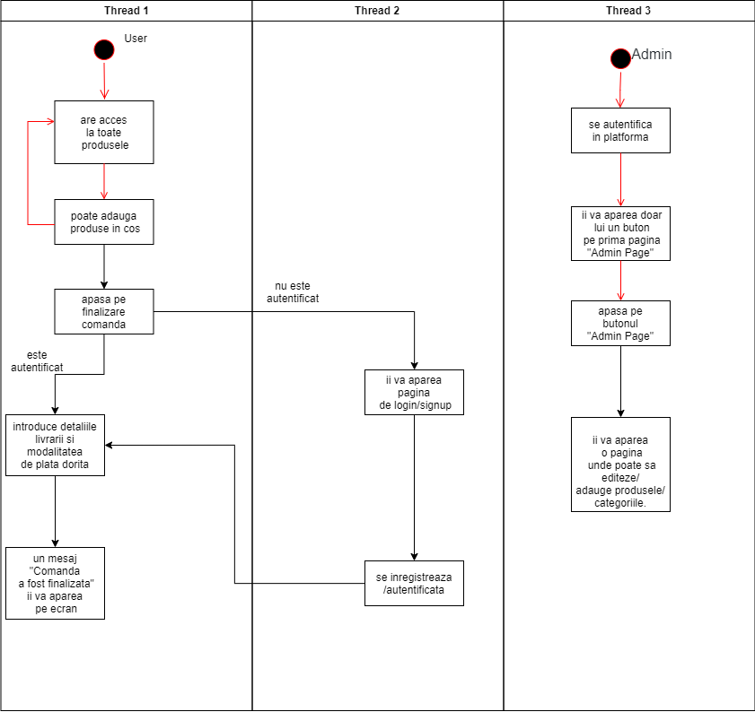

# Basics

## Echipa

* [**Gabriel Cotici**](https://github.com/CoticiGabi)
* [**Catalin Miu**](https://github.com/catalinmiu)

## Descrierea proictului.
  
  Un magazin online care va fi specializat in comercializarea de haine premium, la un pret corect, produse de catre noi sub LOGO-ul "BASICS".
  Pentru vizualizarea produselor nu este necesar autentificarea in aplicatia web si nici pentru adaugarea produselor dorite in cosul de cumparaturi.
  Insa pentru finalizarea comenzii este necesara autentificarea. 
  Adminul va avea o pagina dedicata unde va putea avea control total asupra produselor/clientilor/categoriilor.
  Fiecare utilizator va putea lasa review-uri + rating doar produselor cumparate.
  Utilizatorii vor putea cauta produse dupa cuvinte cheie intr-un "search bar".
  Va exista si o sectiune de "produse favorite" unde utilizatorii isi vor pune produsele favorite.
  Utilizatorii vor mail in cazul in care au un cart nefinalizat sau daca stocul unui produs favorit este foarte scazut.
  
## De ce acest proiect?
  Vrem sa cream un mediu propice pentru a ne putea vinde produsele, si noi consideram ca un magazin online este solutia.
  
## Principalele functionalitati

* Inregistrarea userilor
* Logarea userilor
* Delogarea userilor
* Autorizarea exclusiva a adminului de adauga/updata produse/categorii.
* Un user, posibil client, poate adauga produse in cos.
* Dupa ce se adauga produse in cos, user-ul poate cumpara produsele introduse in cos.

## Cu ce se va deosebi de alte proiecte similare?
  
  Va fi un proiect creat de noi iar clientii vor putea adauga review-uri doar daca au cumparat produsul.
  
## Impedimente posibile
  
  * Nici unul din membrii echipei nu e familiar cu angular iar timpul de realizare este foarte scurt.

## Diagrame de cazuri de urilizare

